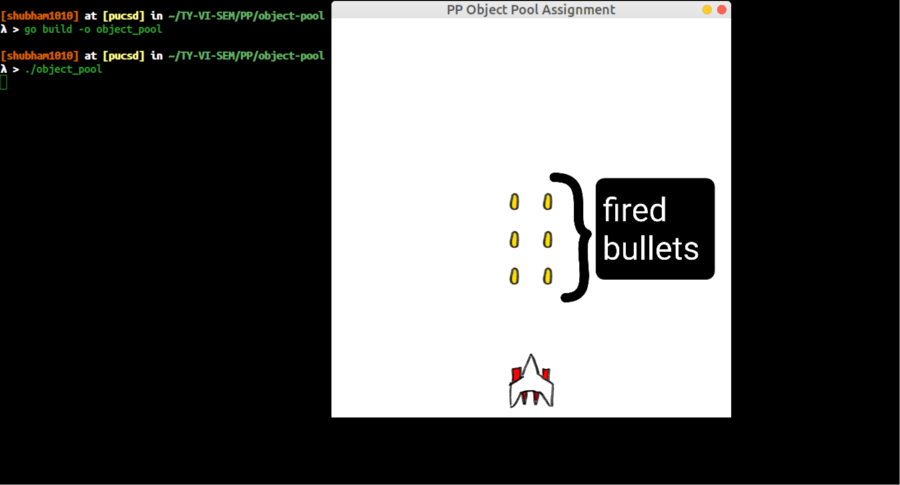

# Object Pool Assignment
This assignment is focused on to understand the object pool design pattern.<br />
In object pool we used our stale objects which require more time to create new and it leads us to optimize our memory performance

## Assignment Overview
In this assignment I have done some simple game, there is a plane who can shoot the bullets.<br />
As we can see that once the bullet is fired from the shooter plane it has no longer usefeul and to create new bullet everytime it is costly to memory and if we are not tracking it's unusefulness it could leads us to memory leak<br /> <br />


<br />
So to use fired bullets again I'm keeping the pool of bullets. I have created only 20 bullets but I can use those 20 bullets infinite times by keeping them into bullets pool. Once the bullet reach to the end of the window I'm putting that bullet into is inactive mode so that we can use that bullet next time instead of creating the new bullet object

## Events of game
1. You can move the plane only to left or right side
2. You can shoot bullets by pressing `spacebar` key
3. In a second use can shoot only 4 bullets
4. Currently pool size is set to 20(means you can create only 20 bullets), you can play with it

## Dependecies:
You have to install libsdl library for C to execute the program.<br />
Please follow the below commands to install libsdl libraries
```
sudo apt-get install libsdl2-dev
sudo apt-get install libsdl-image1.2-dev
sudo apt-get install libsdl-image-gst
```

## Installations
1. Clone the repository
2. You can either execute the program executing `./object_pool` on your teminal, if it fails please follow 3rd step
3. Or you can build the executable first by `go build -o object_pool` command and then follow step 3

## Built with Stack

* [Golang](https://golang.org/): The programming language is used to demonstrate the project
* [GoMod](https://golang.org/ref/mod#introduction): Manage the package depedencies in golang
* [sdl2](https://pkg.go.dev/github.com/veandco/go-sdl2)&nbsp;&nbsp;&nbsp;&nbsp;&nbsp;&nbsp;: Enables interoperability between Go and the SDL2 library which is written in C
* [libsdl](https://www.libsdl.org/)&nbsp;&nbsp;&nbsp;: SDL library which is written in C